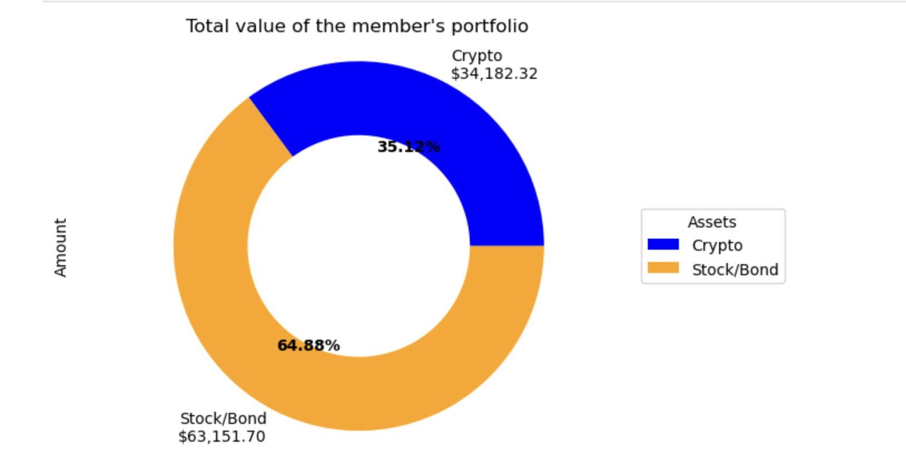

# Financial Planning with APIs and Simulations

This project will have two financial analysis tools by using a single Jupyter notebook:

Part 1: A financial planner for emergencies. The members will be able to use this tool to visualize their current savings. The members can then determine if they have enough reserves for an emergency fund.

Part 2: A financial planner for retirement. This tool will forecast the performance of their retirement portfolio in 30 years. To do this, the tool will make an Alpaca API call via the Alpaca SDK to get historical price data for use in Monte Carlo simulations.

## Technologies Used
This project uses the following technologies:

* `os`- Provides a way of interacting with the operating system.
* `requests` - Allows you to send HTTP/1.1 requests using Python.
* `json` - Used to work with JSON data.
* `pandas` - A library used for data manipulation and analysis.
* `dotenv` - Loads environment variables from a .env file.
* `alpaca_trade_api` - A Python library for the Alpaca trade API.
* `MCForecastTools` - A class written for Monte Carlo simulation.
* `matplotlib` - A plotting library for the Python programming language.
* `warnings` - Provides functions for issuing warnings to the user.
* In addition, the Jupyter Notebook used for this project has the following magic command enabled: `%matplotlib inline`.

## Installation
1. Install the Conda package manager on your local machine, following the instructions for your operating system on the official[Conda website](https://docs.conda.io/projects/conda/en/latest/user-guide/install/).
2. Clone the repository to your local machine using the following command:
```
git clone https://github.com/Xipilscode/Financial_Planning_Projections

```
3. Create a new Conda environment for the project, and activate it. You can do this by running the following commands in your terminal:
```
conda create --name myenv
conda activate myenv

```
4. Install the required dependencies using Conda and pip. You can do this by running the following commands in your terminal:
```
conda install pandas
conda install -c anaconda requests
conda install -c jmcmurray json
conda install matplotlib
pip install python-dotenv
pip install alpaca-trade-api

```
5. Verify that the installations were successful by running the following commands in your terminal:
```
conda list python-dotenv
conda list alpaca-trade-api
conda list json
conda list requests

```
6. Run the Jupyter Notebook file **financial_planning_tools.ipynb** to use the project

## Usage

This repository contains a financial planner for emergencies and retirement.

### Financial Planner for Emergencies
To use the financial planner for emergencies, follow these steps:

1. Set the value of monthly_income to the member's monthly income.
2. Use the requests library to get the current prices of Bitcoin and Ethereum.
3. Use the Alpaca SDK to get the current closing prices of SPY and AGG.
4. Calculate the value of the cryptocurrency wallet, stock and bond holdings, and display the results.
5. Determine if the member has enough savings to build an emergency fund, and display a message with the result.
6. Visualize the composition of the member's portfolio using a pie chart.


### Financial Planner for Retirement
To use the financial planner for retirement, follow these steps:

1. Use the Alpaca SDK to get historical closing prices of SPY and AGG.
2. Use the MCForecastTools class to run a Monte Carlo simulations of a 60/40 portfolio split for 30 years and 20/80 portfolio split for 30 years.
3. Visualize the results of the simulations with an overlay line plots and a probability distribution histograms.


4. Check the results of two Monte Carlo simulations and answer the question: Will weighting the portfolio more heavily towards stocks allow the credit union member to retire after only 10 years?

### Contributors
Alexander Likhachev

### License
MIT